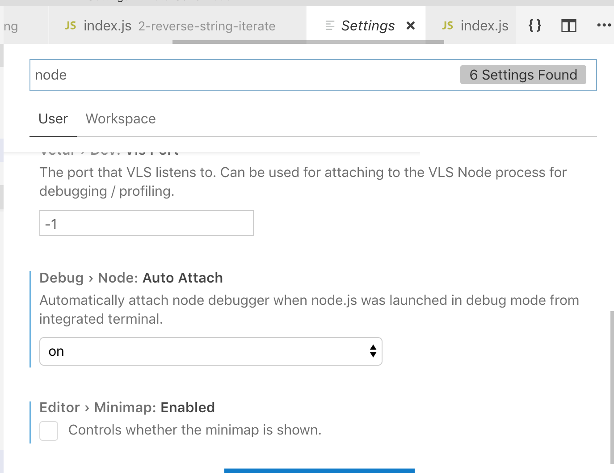

# Debugging node.js in VS Code

There are several ways that you can debug node code besides using console.log.  In this documents we use the debugger tool in Visual Studio code to attach to our node script.

## Option to attach to JS code setting
Go to user settings in VS Code
Search for node
Find Debug > node > AUTO ATTACH  and choose on
<div>

</div>

## Add break points to code
Go to code and use the toggle in left margin to turn on break points 

## Add "inspect break" option to command line when running program

```bash
node --inspect-brk <name of program>
```

Read about [debugging in VS Code](https://code.visualstudio.com/docs/editor/debugging)